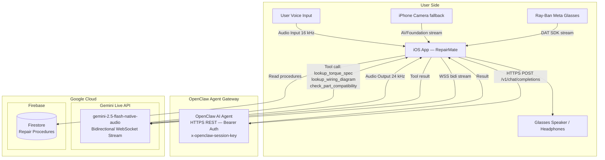
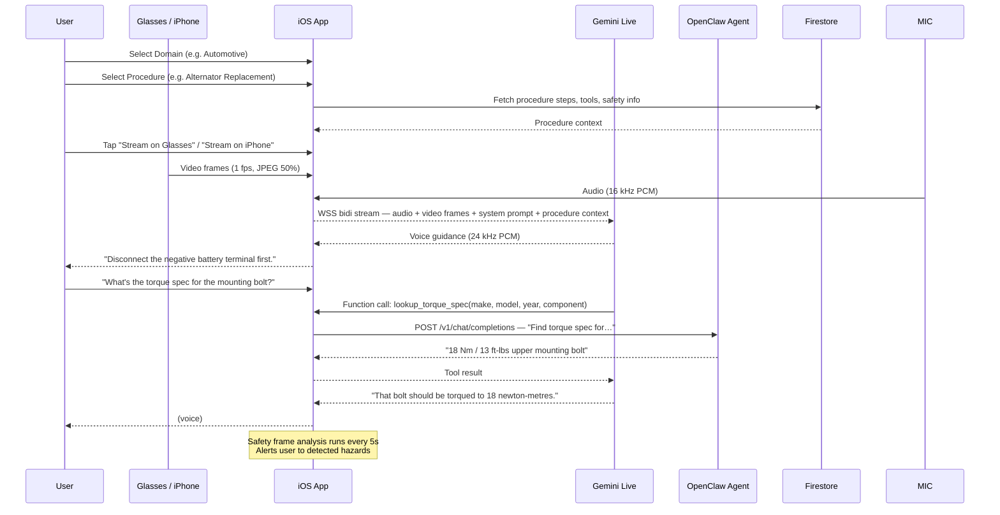
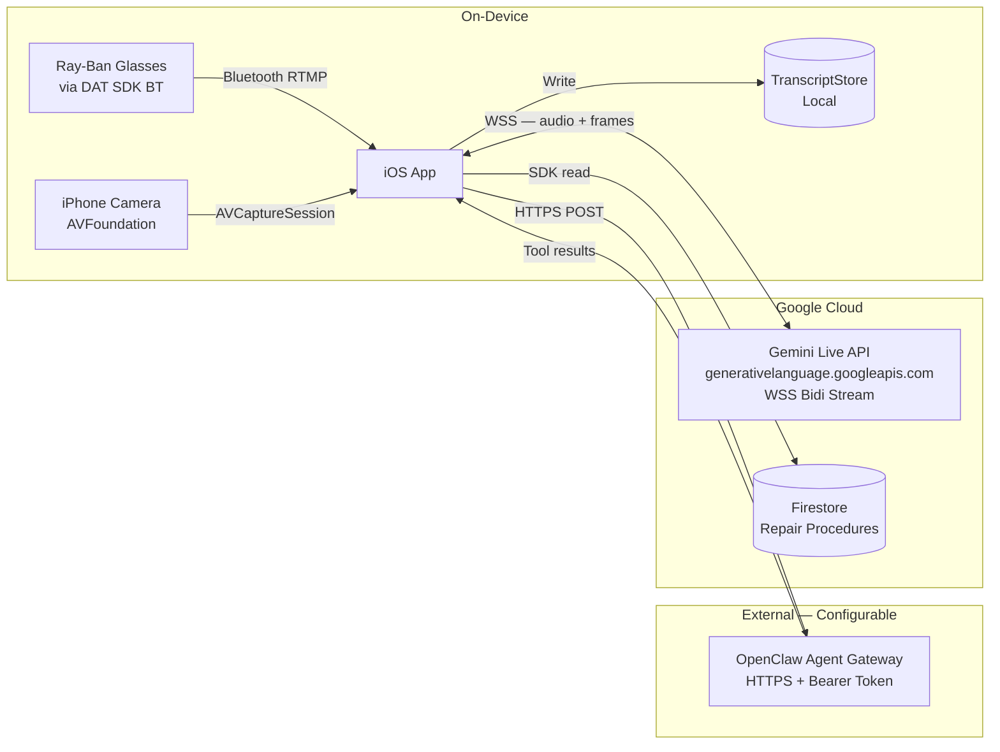

# RepairMate — Architecture

## High-Level System Architecture

---

## Data Flow: Streaming a Repair Session

---

## Component Breakdown

| Component                 | Technology                               | Purpose                                                                          |
| ------------------------- | ---------------------------------------- | -------------------------------------------------------------------------------- |
| **Ray-Ban Meta Glasses**  | Meta DAT SDK                             | Primary POV camera + microphone input                                            |
| **iPhone Camera**         | AVFoundation                             | Fallback camera when glasses unavailable                                         |
| **iOS App**               | Swift / SwiftUI                          | Streaming, audio I/O, UI, session orchestration                                  |
| **Gemini Live API**       | `gemini-2.5-flash-native-audio` via WSS  | Bidirectional audio + vision AI assistant                                        |
| **OpenClaw Gateway**      | External HTTPS agent (configurable host) | Executes repair tool lookups — torque specs, wiring diagrams, part compatibility |
| **Firestore**             | Firebase / Google Cloud                  | Read-only repair procedure library (steps, tools, safety warnings)               |
| **TranscriptStore**       | Local on-device (UserDefaults)           | Saves session transcripts for later review                                       |
| **SafetyAnalysisService** | Gemini frame analysis                    | Periodic hazard detection from live video frames                                 |

---

## Deployment Architecture

> **No Cloud Run or Load Balancer.** The iOS app connects directly to the Gemini Live API via a secure WebSocket. OpenClaw is a separately hosted agent gateway accessed over HTTPS, not a cloud-managed service deployed with this app.

---

## RepairMate Tool Calls (via OpenClaw)

Gemini triggers these when it needs domain-specific data during a repair session. The iOS app proxies each call to OpenClaw and returns the result to Gemini as a function result.

| Tool                       | Trigger                                         | Args                                        |
| -------------------------- | ----------------------------------------------- | ------------------------------------------- |
| `lookup_torque_spec`       | User needs exact torque value during reassembly | make, model, year, component, bolt_location |
| `lookup_wiring_diagram`    | User confused about electrical connections      | system, make, model, year                   |
| `check_part_compatibility` | User has a part number or unsure if part fits   | part_number, make, model, year              |

---

## Security

| Concern                | Implementation                                                   |
| ---------------------- | ---------------------------------------------------------------- |
| **Gemini API Key**     | Stored in iOS Keychain; read at runtime — never compiled in      |
| **OpenClaw Token**     | Bearer token stored in Keychain; sent as `Authorization` header  |
| **Session continuity** | `x-openclaw-session-key` header (rotating ISO8601 timestamp key) |
| **Transport**          | WSS (Gemini) + TLS HTTPS (OpenClaw + Firestore)                  |

---

## Tech Stack Summary

| Layer              | Technology                                            |
| ------------------ | ----------------------------------------------------- |
| **Mobile**         | Swift, SwiftUI, Combine                               |
| **AI / Vision**    | Gemini 2.5 Flash Native Audio (bidi WSS)              |
| **Tool Execution** | OpenClaw Agent Gateway (HTTPS REST)                   |
| **Data**           | Firestore (procedures), UserDefaults (transcripts)    |
| **Hardware**       | Ray-Ban Meta AI Glasses (DAT SDK), iPhone camera      |
| **Protocol**       | WebSocket bidi stream (Gemini), HTTPS POST (OpenClaw) |
